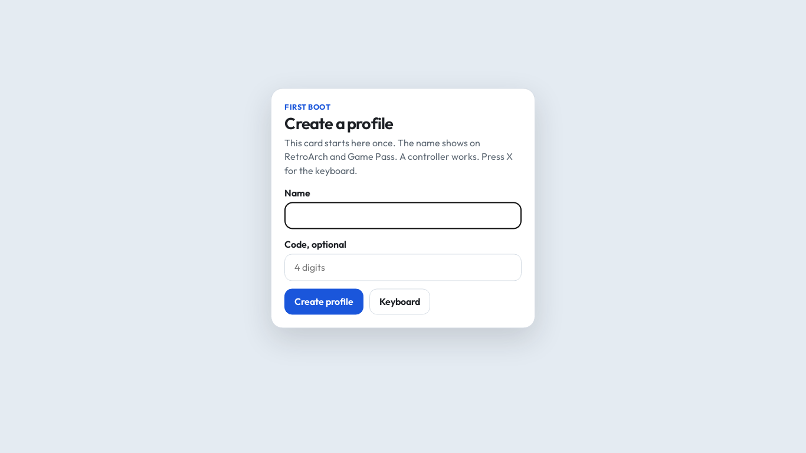
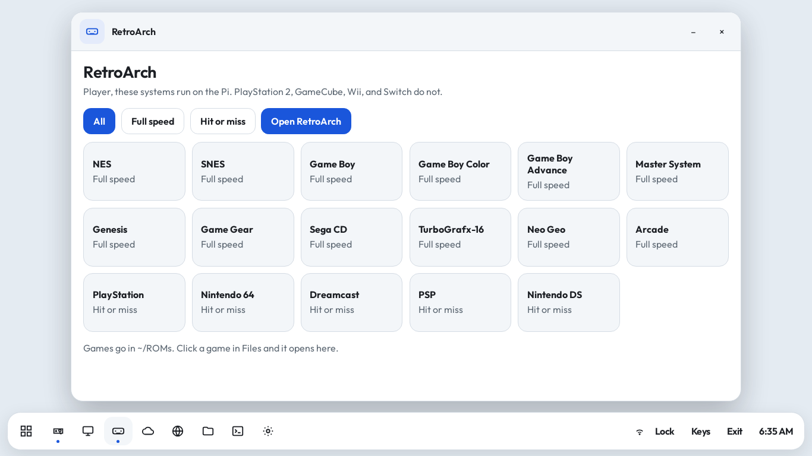
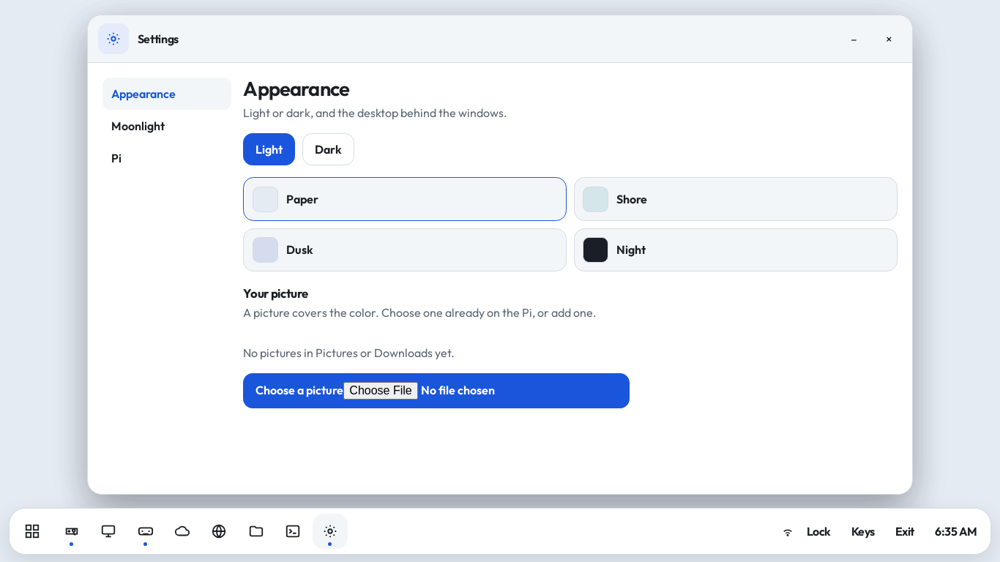
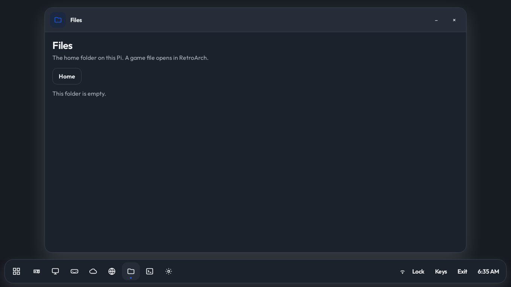
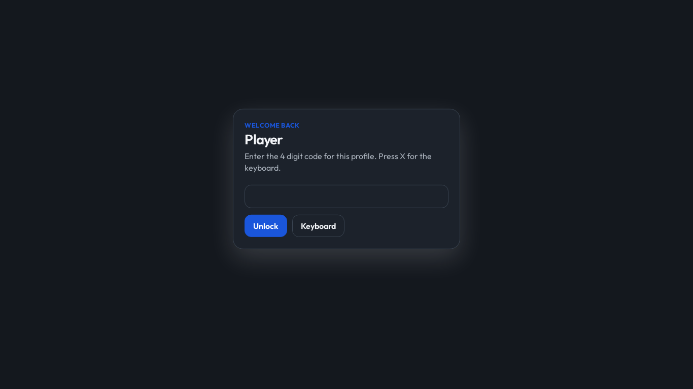

# bazzpi

The Raspberry Pi 4 card is 1.4 GB, which GitHub will not store. Download it from Google Drive:

https://drive.google.com/file/d/1BeyM0He6PqmQmgVj11wKYVM84JEDsZID/view

Flash `bazzpi-desktop.img.xz` with Raspberry Pi Imager using **Use custom**.

After the desktop is up, install the shelf so the Pi looks like the app:

```bash
curl -fsSL https://raw.githubusercontent.com/dbrush95/pibazz/main/install.sh | bash
```

Then log out and back in, or reboot.

Raspberry Pi OS Lite does not have a desktop. Flash Lite, turn on SSH in Imager, then from that Pi run:

```bash
curl -fsSL https://raw.githubusercontent.com/dbrush95/pibazz/main/install-lite.sh | bash
```

Reboot. Linux logs in on its own. The shelf still asks you to make a profile. Play opens Moonlight, Desktop opens the PC, RetroArch plays files in `~/ROMs`, and the browser, files, and terminal are the real programs.

- Play and Desktop open Moonlight
- Browser, Files, and Game Pass open the real programs
- Settings changes light and dark, the wallpaper, and the Pi options
- Quit a stream with Ctrl+Alt+Shift+Q
- SHA256 of the card: `c8d9ceefaaa66b6b4f65e4ce911b017b7400c35e2422d52bb1d70cf900c9c83a`

## Shelf










