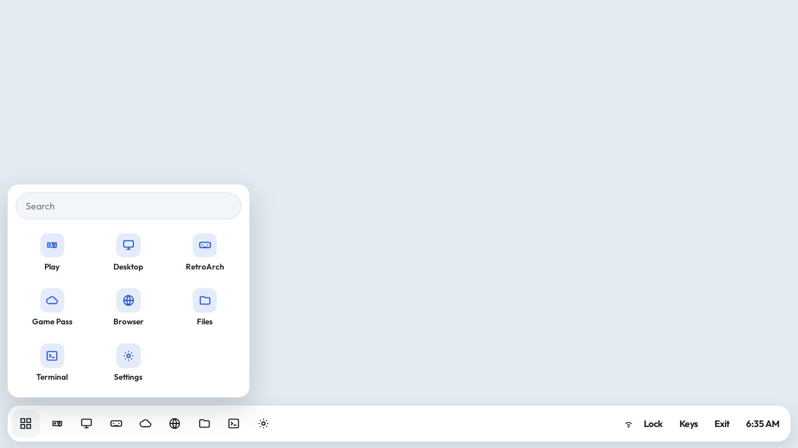
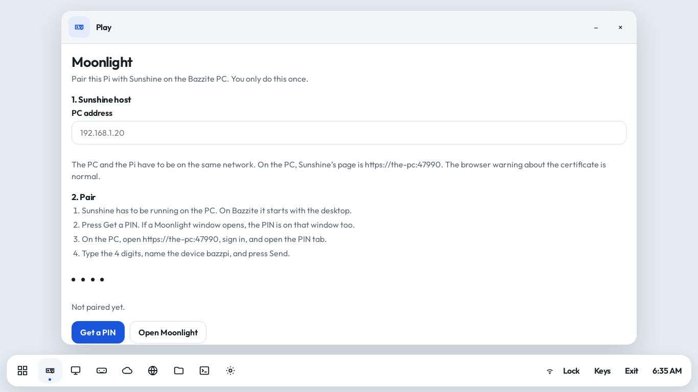
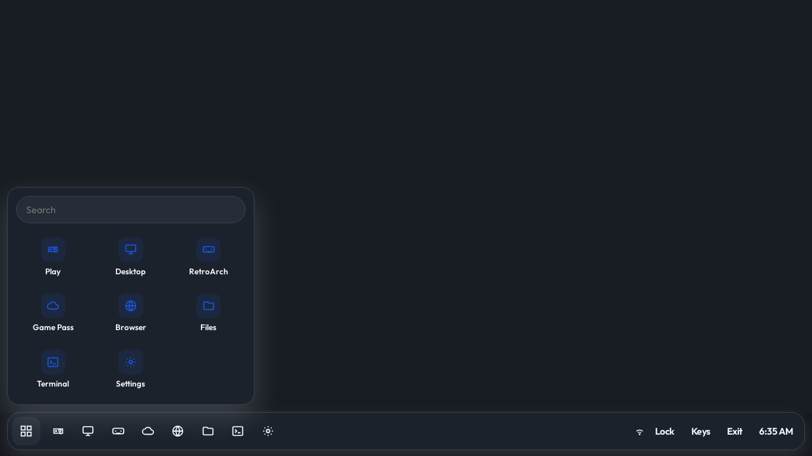

# Bazzpi — a living-room shelf for Raspberry Pi OS Lite

A light, controller-friendly shelf on labwc with Moonlight Qt, a real Chromium browser,
Files, RetroArch, and Settings. Stream a Bazzite PC running Sunshine across your home LAN.
No router forwarding, public IP, VPN, or UPnP is needed. Internet is only needed for installation,
GitHub update checks, and internet apps such as Browser/Game Pass; installed LAN streaming works offline.

## Install or upgrade Lite

Use **Raspberry Pi OS Lite 64-bit, Bookworm or later**, on a Pi 4. Configure your normal user,
Wi-Fi (if needed), and SSH in Raspberry Pi Imager. Ethernet is preferable for the PC and Pi.
Run as the normal Pi user, **not root**:

```bash
curl -fL https://raw.githubusercontent.com/dbrush95/pibazz/main/install-lite.sh -o /tmp/install-bazzpi.sh
bash /tmp/install-bazzpi.sh
sudo reboot
```

Run the installer once again on an existing Lite installation to add the missing audio/session
packages and the new managed labwc configuration. It retains the device profile and migrates
Chromium preferences on first launch. Back up your SD card before upgrading your only working device.
The installer requires internet, installs the Pi-specific Moonlight package source, and makes boot
configuration changes only during installation. Each child's card should be installed separately;
do not clone a used card containing browser sign-ins and Moonlight credentials.

### Test this improvement branch before merging

```bash
curl -fL https://raw.githubusercontent.com/dbrush95/pibazz/improve/lite-lan-desktop/install-lite.sh -o /tmp/install-bazzpi.sh
BAZZPI_UPDATE_REF=improve/lite-lan-desktop bash /tmp/install-bazzpi.sh
mkdir -p ~/.config/bazzpi
touch ~/.config/bazzpi/updates-disabled
sudo reboot
```

Pause updates during branch evaluation so the next boot does not return to `main`.
After this branch is merged, resume them with:

```bash
rm -f ~/.config/bazzpi/updates-disabled
sudo reboot
```

## Connect the PC

1. Start Sunshine in the Bazzite session you intend to stream. Keep its display/capture available.
2. In **Play**, enter the PC's LAN IPv4 address (for example `192.168.1.20`). A DHCP reservation
   on your router keeps it stable. Pasting `https://192.168.1.20:47990` is accepted too.
3. Choose **Test connection**. Discovery, pairing, and stream setup should answer.
   The settings port is informational; it may be restricted to the PC itself.
4. Choose **Get a PIN**. On the PC, open Sunshine's settings at `https://localhost:47990`,
   enter the four digits, and give this Pi a distinct name.
5. Refresh apps, select the exact Sunshine app, and press Play. Steam does not automatically
   switch Bazzite into Game Mode. Desktop captures the active session Sunshine can access.

Defaults: **1080p / 60 fps / H.264 / 20 Mb/s / automatic decoder**. Set the Pi's TV output to
1080p too. Hardware-only is available once you verify it works; software mode is diagnostic,
not a promise of smooth 1080p60. Check Moonlight's stream statistics for decoder and frame drops.
The installer preserves the Pi OS KMS display driver and sets `gpu_mem=128`.

## One desktop flow

- The shelf retains its light/dark palette, launcher, file view, and app windows.
- Native app title bars use the Bazzpi light theme. Browser has real tabs, downloads, and sign-ins
  in its own profile; it is a native window, not an iframe inside the shelf.
- Close the native application to return home. **Super/Windows + H** brings the shelf forward;
  **Alt + Tab** returns to the application. **Alt + F4** closes its active window.
- Only one shelf-launched native app runs at a time, avoiding duplicate Moonlight streams and
  ambiguous return-to-home behavior. Close all browser windows to finish that browser session.
- End streaming with **Ctrl + Alt + Shift + Q**. Moonlight also supports its controller quit combo.
- Shelf gamepad navigation pauses while a native app is running so gameplay cannot trigger shelf actions.
- Launch failures remain visible with the recorded error. They are not reported as successful streams.
- PIN protects shelf API actions as well as its screen. It is a convenience lock, **not parental
  control or Linux account isolation**; the Terminal and keyboard shortcuts are still available.
- Each Pi has its own profile and pairing. Multiple Pis connected to one normal Sunshine session
  share that host desktop/game; this does not create independent simultaneous gaming seats.

## Updates on reboot

The first shelf launch each boot checks `dbrush95/pibazz` **main**, bounded to 35 seconds.
It resolves one commit, downloads all shelf files for that commit, checks Python/JavaScript/shell
syntax, and atomically changes the `current` symlink. A failed download leaves the current version
intact. The prior version is retained. If the new Python backend fails its startup health check,
the launcher restores the prior version and suppresses that broken revision on subsequent boots.

This health check is not a full Pi streaming or visual test. It cannot automatically catch every
runtime/UI/decoder regression. Test changes on one Pi before merging them to `main` for the family.
Boot updates cover shelf code, **not apt packages, installer changes, compositor config, or the OS**.
Rerun the installer when those dependencies change. Releases are retained on disk for manual recovery.

Pause automatic updates: `touch ~/.config/bazzpi/updates-disabled`.
Status and logs: `~/.local/state/bazzpi/` (also shown in Settings → Pi).
Manual rollback from SSH:

```bash
touch ~/.config/bazzpi/updates-disabled
cd /opt/bazzpi-shelf
# Only continue if previous points to a release directory:
test -d previous && ln -sfn "$(readlink -f previous)" current.rollback
test -L current.rollback && mv -Tf current.rollback current
sudo reboot
```

## Connection troubleshooting

See [docs/LAN-TROUBLESHOOTING.md](docs/LAN-TROUBLESHOOTING.md). A working Sunshine web page
or a firewall rule alone does not verify video streaming. The shelf distinguishes TCP reachability
from pairing and retains actual Moonlight errors. No testing here can verify your physical LAN remotely.

## Development / validation

```bash
python3 -m unittest discover -s tests -v
node --check shelf/shelf.js
bash -n install-lite.sh install.sh shelf/update.sh shelf/bazzpi-shelf
```

Tests cover host input, pairing, CLI settings, app-list errors, API locking/cross-origin protection,
and update success/offline/partial/invalid/rejected-revision paths. They do not emulate Pi decoding.
See [docs/PI-ACCEPTANCE.md](docs/PI-ACCEPTANCE.md) for the device acceptance checklist.

The older desktop-image download and installer are still available in git history; this work targets
Lite. `install.sh` remains the desktop-overlay installer; it does not install the complete Lite session.

## Reference screenshots

These are the original design references, not screenshots of the changes in this branch.





To collect a Pi diagnostic report without changing its settings:

```bash
bash tools/moonlight-diagnostics.sh 192.168.1.20
```

It writes `~/moonlight-diagnostics.txt` with OS/packages, video devices, audio status,
TCP port results, and the last app log. Review it before sharing; it includes local host/user details.

## Controller and settings polish

- Left stick: shelf cursor (with a drift deadzone); right stick: scroll.
- D-pad: move between visible controls; A: select; B: back/done; X: keyboard; Start: launcher.
- Selecting a text field opens the keyboard. PIN fields use numbers and enforce four digits.
- On a selector, A cycles options; D-pad left/right changes the selection.
- The shelf's controller pointer and keyboard operate **inside the shelf**, not in native Chromium,
  RetroArch, Moonlight, or the full raspi-config terminal. Native applications retain their own input.
- Play now separates game launching from collapsible pairing, picture, and troubleshooting controls.
- Settings → Pi reads actual hostname, Wi-Fi country, timezone, SSH and audio output. It validates
  changes and waits for system commands before reporting success. Apply only sends changed values.
- **Open full raspi-config** starts the standard tool in a terminal; use a physical keyboard there.
  The shelf form covers the common options; it is not a clone of every raspi-config menu.
- Rerun `install-lite.sh` once to add `pulseaudio-utils` for the audio output selector. The shelf code
  and controller changes otherwise arrive through the existing reboot updater.
